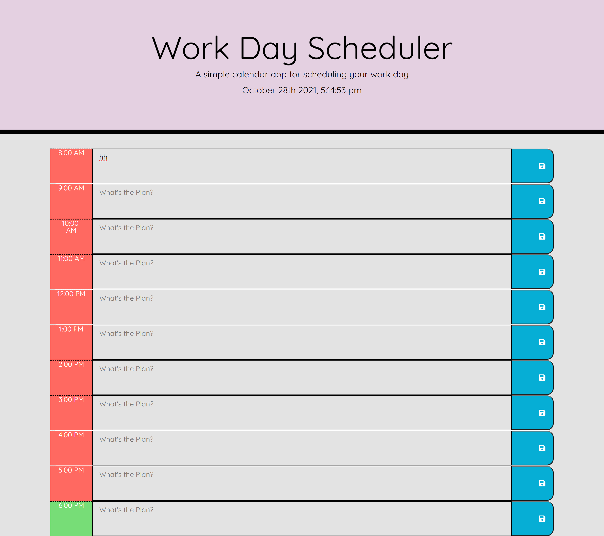

# Online Daily Planer 

    
    

    
    
    
    
    

## Overview

This project contains html, css, and js, along with Jquery and Bootstrap
for daily online planner that contains 11 slots to add hourly events 
includes jumbotran, area were to add description, and local storage. 

## Table of Contents
- [Overview](#overview)
- [Authors](#authors)
- [Preview](#preview)
- [Features](#features)
- [Demo](#linktodeployedpage)
- [Preview](#preview)
- [Repo](#linktodeployedrepo)
- [Contribution](#contribution)
- [License](#license)
- [Bugs](#bugs)

## Authors
- Author: Sophia
- GitHub: [soph-k](https://github.com/soph-k)
- Version 1.1

##  Link to Deployed Page

[Live Demo](https://soph-k.github.io/online_daily_planner/)

## Screen Shot

## Features
- HTML 
- CSS 
  - Bootstrap
- Javascript 
  - JQuery 

    
## Link to Repo Page

[Repo](https://github.com/soph-k/online_daily_planner) 

## Contribution
Contributions are accepted. Feel free to fork without permission.

## License
This project is under the MIT license.

### Questions
For questions about this project, please review my GitHub repo at [soph-k](https://github.com/soph-k) or contact me on Github.

### Bugs 
- Local storage is not working.

- Color attr not working. 
